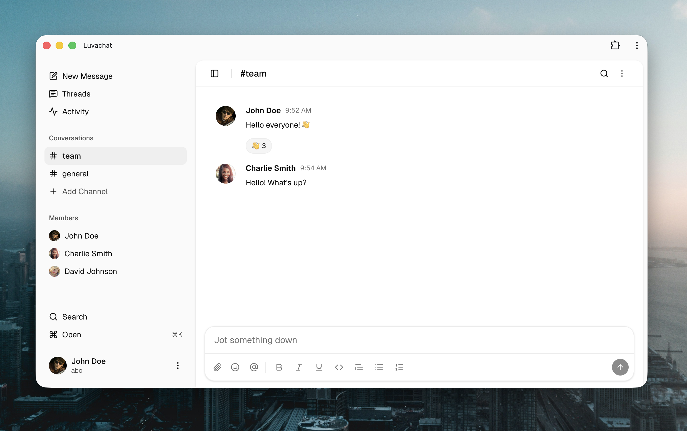

# Luvachat

<a target="_blank" href="https://luvabase.com/apps/luvachat/install"></a>
<a target="_blank" href="https://deploy.workers.cloudflare.com/?url=https://github.com/simonbengtsson/luvachat"></a>

🌎 Team messaging with channels, DMs, threads, and search.<br>
💬 Rich text messages, emoji reactions, file attachments, and push notifications.<br>
❤️ Open source and self-hostable on Luvabase and Cloudflare.<br>



## What is Luvachat?

Luvachat is your self-hostable team chat app. Think Slack, but smaller and built for teams that want workspace messaging they can run themselves. It includes channels, direct conversations, threaded replies, activity, message search, rich text, and attachments.

## Getting started

The easiest way to use Luvachat is to [install it on Luvabase](https://luvabase.com/apps/luvachat/install). On Luvabase authentication and workspace members are managed for you.

Another option is to [Deploy on Cloudflare](https://deploy.workers.cloudflare.com/?url=https://github.com/simonbengtsson/luvachat) and run Luvachat on your own Cloudflare account (see below to setup Cloudflare access)

If you deploy Luvachat to Cloudflare without setting up Cloudflare Access or run it locally it will run in a demo mode with some sample members.

Run the app in demo mode locally with:

```bash
bun install
bun run dev
```

### Cloudflare

When you deploy to Cloudflare Luvachat will run in demo mode by default. To change into production, start with restricting access to the worker and then configure the below worker env variables.

To restrict access to a worker the easiest way is to go to the worker in the Cloudflare dashboard -> domains -> click Public and change to Restricted. This will show the AUD and JWKS url that you can then copy and add as env variables together with the members json. For a Cloudflare Access user to be able to use the app their email must match an email in the members list.

By default when restricting access to a worker it is only allowing the currently logged in Cloudflare user. Click Manage policy to update this and the easiest is to set the policy to allow "everyone" since only members listed in the members json will be allowed access anyway.

- `CF_ACCESS_AUD`: The Cloudflare Access application audience tag
- `CF_ACCESS_JWKS_URL`: The Cloudflare Access JWKS URL`
- `CF_MEMBERS_JSON`: the workspace members as JSON. Example:

```json
[
  {
    "email": "alice@example.com",
    "name": "Alice Andersson",
    "imageUrl": "https://example.com/alice.png"
  },
  {
    "email": "bob@example.com",
    "name": "Bob Berg",
    "imageUrl": null
  }
]
```

## Stack

Luvachat is built as a TanStack Start app with a real-time sync and persistence layer on Cloudflare Durable Objects.

- Server: Cloudflare Durable Objects, Worker, R2, ORPC, Drizzle
- Client: React, Shadcn, TanStack Router, TanStack Query, Tailwind
- Rich text editing with [Tiptap](https://tiptap.dev)

## Contributions

Very much welcome! The goal is to keep Luvachat focused and easy to self-host, but below are some examples of what would be in scope:

- Better unread and notification controls
- More powerful search filters
- Message editing and deletion
- Workspace administration screens
- Improved thread and conversation summaries
